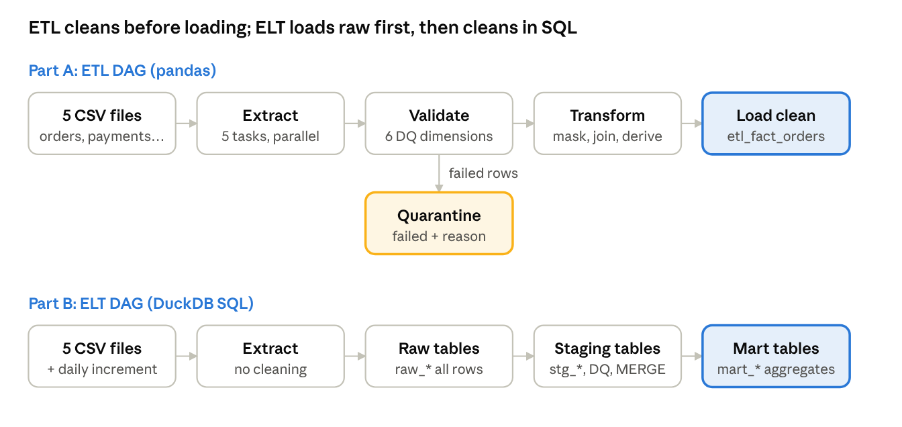

# NammaMart Quick Commerce — ETL & ELT Pipeline Assignment

FDAIE Module 2 · Data Engineering Foundations

## 1. Client brief

You are a Forward Deployed Engineer (FDE) placed at NammaMart. Your job: replace a manual, error-prone morning report with automated ETL and ELT pipelines in Apache Airflow that deliver reconciled numbers by **9:00 AM IST every day**.

**The client.** NammaMart Quick Commerce Pvt Ltd is a fictional 10-minute grocery delivery company in Bengaluru. It runs 15 dark stores across 4 zones (North, South, East, West) and sells about 150 products in 6 categories. In September 2026 it processed about 2,400 orders.

**The problem today.** Every morning at 9:30 AM, the COO, Kavya, runs an operations review with the store managers. The numbers come from an ops analyst who downloads five exports (orders, payments, customers, products, stores), joins them in Excel and emails a summary around 10:30 AM.

- **Late:** the review starts before the numbers arrive, so decisions are made on yesterday's gut feel.
- **Doesn't reconcile:** order revenue never matches the payment gateway. Finance spends half a day each week finding out why.
- **Inflated metrics:** duplicate orders and test entries count toward revenue, and impossible delivery times (hours instead of minutes) distort the "10-minute promise" KPI.
- **Privacy risk:** customer names, emails and phone numbers are passed around in spreadsheets with no access control.
- **No history:** when an order is returned days later, the old spreadsheet is never corrected.

**Why they hired an FDE team.** NammaMart has no data engineers. They want someone to sit with ops and finance, agree on what "correct" means, and ship a working, observable pipeline on open-source tools only.

**Why both ETL and ELT.** The CTO, Sameer, is undecided:

- **Finance** wants only validated, reconciled orders in the reporting tables. A bad row must never reach the CFO's dashboard. That points to **ETL**.
- **Analytics and compliance** want every raw record kept exactly as received, so they can audit, replay history and answer new questions with SQL later. That points to **ELT**.

Sameer has asked you to build **both pipelines on the same data**, run them side by side, and recommend which one NammaMart should adopt.

## 2. What the client expects

Sameer signs off only when all ten acceptance criteria below are met and demonstrated in the Airflow UI.

| # | Client expectation | How you prove it |
| --- | --- | --- |
| 1 | Report data ready **before 9:00 AM IST, Monday to Saturday** | Both DAGs scheduled for 9:00 AM IST; screenshot of the schedule and the next-run time |
| 2 | No bad order ever reaches the finance tables | ETL fact table holds only rows that passed every critical check |
| 3 | Every raw record kept, untouched, for audit | ELT raw tables hold all source rows exactly as received |
| 4 | Bad rows set aside with a reason, never silently dropped | Quarantine file or table with a `failure_reason` column |
| 5 | Re-running never double-counts revenue | Trigger twice; fact row counts don't change |
| 6 | Next-day file loads incrementally, and late status changes are applied | Load `orders_2026-10-01_increment.csv`: new orders appended, returned orders updated, no duplicates |
| 7 | Orders reconcile with payments | A reconciliation table listing every order/payment mismatch |
| 8 | Customer personal data is protected | Email and phone masked in every reporting table |
| 9 | Anyone can see whether today's run worked, and why not | Run history, task logs and a run-audit table |
| 10 | A written recommendation: ETL or ELT for NammaMart | One-page recommendation in your submission |

**Business questions the output must answer** (each should be one simple query on your final tables):

1. Daily net revenue by zone and by store (delivered orders only, after discount).
2. Revenue and gross margin by product category (margin = revenue − quantity × cost_price).
3. Average delivery time per store, and the % of delivered orders within 15 minutes.
4. Revenue by payment mode, and the total amount that doesn't reconcile with the payment gateway.
5. Top 10 customers by spend, with loyalty tier (no raw email or phone shown).
6. Number of rows rejected today, by file and by reason.

## 3. Data provided

You get six CSV exports from NammaMart's systems in [`assignment/nammamart_dataset/`](nammamart_dataset/): 5,372 rows in total, covering 1–30 September 2026, plus a next-day file. Copy them into `include/data/nammamart/` and never edit them by hand.

| File | Rows | Columns | Source system | Type |
| --- | --- | --- | --- | --- |
| `orders.csv` | 2,412 | order_id, order_ts, customer_id, store_id, product_id, quantity, unit_price, discount_pct, order_amount, payment_mode, order_status, channel, delivery_minutes | Order management system | Fact |
| `payments.csv` | 2,228 | payment_id, order_id, payment_ts, payment_mode, amount_paid, payment_status, gateway_ref | Payment gateway | Fact |
| `customers.csv` | 405 | customer_id, full_name, email, phone, city, area, pincode, signup_date, loyalty_tier, is_active | CRM (contains personal data) | Dimension |
| `products.csv` | 152 | product_id, product_name, category, sub_category, brand, mrp, cost_price, unit, is_perishable, launch_date | Product catalogue | Dimension |
| `stores.csv` | 15 | store_id, store_name, zone, area, pincode, open_date, manager_name, capacity_orders_per_day | Store master | Dimension |
| `orders_2026-10-01_increment.csv` | 160 | Same 13 columns as orders.csv | Next-day order export | Incremental feed |

**Relationships**

- `orders.customer_id` → `customers.customer_id`
- `orders.product_id` → `products.product_id`
- `orders.store_id` → `stores.store_id`
- `payments.order_id` → `orders.order_id` (cancelled orders have no payment)

**Business rules from the client**

- `order_amount = quantity × unit_price × (1 − discount_pct / 100)`, rounded to 2 decimals.
- Valid `order_status`: DELIVERED, CANCELLED, RETURNED. Only DELIVERED counts as revenue.
- Valid `payment_mode`: UPI, Card, Cash on Delivery, Wallet.
- Deliveries normally take 8–35 minutes. A DELIVERED order must have a `delivery_minutes` value.
- A SUCCESS payment must equal its order's `order_amount`.
- The increment file contains new orders **and** corrections to older orders, such as a status changing to RETURNED.

**Warning from the client:** "Our exports are not clean. There are problems in every file, but we don't know exactly which rows." Finding them is part of your job. Profile every file before you write pipeline code, and log every issue (file, row key, column, problem, quality dimension).

## 4. Tools and environment

Use the environment from the **Learner Setup Guide** you already completed. Nothing new to install, and every tool is open source.

| Tool | Role in this assignment |
| --- | --- |
| Apache Airflow (TaskFlow API: `@dag`, `@task`) | Orchestration and scheduling |
| Astro CLI (Astronomer) | Runs Airflow locally in Docker with one command, no manual setup |
| Docker Desktop | Runs the Airflow containers |
| pandas | Transformations in the ETL pipeline |
| DuckDB | Local warehouse (`include/warehouse.duckdb`) and SQL transformations in the ELT pipeline |
| VS Code + SQLTools / Rainbow CSV | Code, profile CSVs, query DuckDB |
| Git + GitHub | Version control and submission |

**Rules**

- Work inside the cloned project. Copy the dataset into `include/data/nammamart/`. Put new DAGs in `dags/` and helper code in `include/`.
- Do **not** modify the trainer's `meridian_pipeline.py`. Build your own DAGs alongside it.
- Use your own warehouse file, `include/warehouse_<your_name>.duckdb`, so you don't collide with the demo tables.
- If you add a Python package, add it to `requirements.txt` and run `astro dev restart`.
- No paid tools and no secrets in code. Read any keys with `Variable.get()`.

**Useful commands**

- `astro dev start` / `astro dev stop` / `astro dev restart`
- `astro dev run dags list-import-errors`: check that your DAG parses
- `astro dev run dags test <dag_id>`: run a DAG once from the terminal
- Airflow UI: `http://localhost:8080` (admin / admin)

## 5. Your tasks

There are seven parts. Do them in order: each one builds on the last.

### Part 0: Discovery and data profiling (FDE first step)

Before writing pipeline code, do what an FDE does on day one: understand the data and the client's definition of "correct".

1. Profile all six files: row counts, nulls per column, duplicate keys, min/max of every numeric and date column, distinct values of every category column (`order_status`, `payment_mode`, `loyalty_tier`, `zone`, `category`).
2. Check referential integrity across all four relationships in Section 3.
3. Check every business rule in Section 3, for example recompute `order_amount` and compare.
4. Fill in a **Data Issues Log**: file, row key, column, problem, quality dimension, proposed rule, severity. Aim to find issues in **every** file.
5. Write 3 questions you would ask the client before building, for example "Is a negative quantity a return or a data-entry error?"

### Part A: Build the ETL pipeline

Create `dags/nammamart_etl_<your_name>.py`. Flow: **Extract → Validate → Transform → Load.**

1. **Extract:** five parallel tasks, one per master/daily file.
2. **Validate:** apply your data quality rules (Part D) in Python. Split each file into *passed* and *failed* rows.
3. **Quarantine:** write failed rows to `include/quarantine/<your_name>/<file>_failed_<run_id>.csv` with a `failure_reason` column.
4. **Transform:**
   - Standardise values (trim, fix casing, map `upi` and `UPI ` to `UPI`).
   - Deduplicate customers and products.
   - Mask email and phone (for example `pr***@example.com`, `98******21`).
   - Join orders with customers, products and stores.
   - Derive `order_date`, `net_revenue`, `gross_margin` and `within_15_min`.
5. **Load** into DuckDB, as a star schema:
   - Fact table: `etl_fact_orders`.
   - Dimension tables: `etl_dim_customer`, `etl_dim_product`, `etl_dim_store`.
   - Loading must be **idempotent**.
6. **Reconcile:** compare clean orders with `payments.csv` and write `etl_payment_reconciliation`, one row per mismatch with a reason.
7. **Report:** a final task that builds `etl_daily_zone_revenue` and `etl_category_margin` and prints them in the log.

### Part B: Build the ELT pipeline

Create `dags/nammamart_elt_<your_name>.py`. Flow: **Extract → Load raw → Transform in the warehouse with SQL.** Use these three layers in DuckDB:

| Layer | Tables | Rule |
| --- | --- | --- |
| Raw | `raw_orders`, `raw_payments`, `raw_customers`, `raw_products`, `raw_stores` | Exact copy of each CSV, all columns as text, plus `_loaded_at`, `_source_file` and `_run_id`. Never cleaned, never deleted. |
| Staging | `stg_orders`, `stg_payments`, `stg_customers`, `stg_products`, `stg_stores` | SQL only: cast types, standardise, dedupe, mask PII, apply quality rules, add `dq_status` and `failure_reason` |
| Mart | `mart_daily_store_kpis`, `mart_category_margin`, `mart_delivery_sla`, `mart_payment_reconciliation`, `mart_top_customers` | SQL only: business-ready tables that answer the six business questions |

1. Load every raw row, including the bad ones, with no pandas cleaning.
2. Write each transformation as a `.sql` file in `include/sql/`, run by an Airflow task. Use one task per layer or per table.
3. **Incremental load:** add a step that loads `orders_2026-10-01_increment.csv`.
   - Raw: append the rows.
   - Staging: **MERGE / upsert** on `order_id`, so the 10 status corrections overwrite the old rows and the 150 new orders are added.
4. Your mart totals must **match** your ETL totals for September. If they don't, explain exactly why.

Both DAGs read the same five files. ETL rejects bad rows before the warehouse; ELT keeps every raw row and filters them out in staging.

### Part C: Schedule both DAGs for 9:00 AM IST

The client's SLA is data ready before the 9:30 AM leadership stand-up, Monday to Saturday.

1. Schedule both DAGs at **9:00 AM IST, Monday to Saturday**, using a cron expression.
2. Make the timezone explicit with a timezone-aware `start_date` (`pendulum`, `Asia/Kolkata`). By default Airflow assumes UTC.
3. Set `catchup=False` and justify it.
4. Add `retries`, `retry_delay` and an `execution_timeout` in `default_args`.
5. Answer in your submission:
   - What is your cron expression?
   - What time does the run show in UTC in the Airflow UI?
   - What would happen at 9 AM if you had left the `start_date` in UTC?
   - What happens if your laptop or Docker is off at 9 AM?

### Part D: Set up data quality dimensions

Implement **at least one check for each of the six dimensions below**, in both pipelines (Python in ETL, SQL in ELT). Each check needs a severity: **Critical** rows are quarantined; **Warning** rows load, but are logged.

| Dimension | Question it answers | Example checks for NammaMart (design more of your own) | Suggested severity |
| --- | --- | --- | --- |
| Completeness | Is required data present? | `customer_id` not null in orders; DELIVERED orders have `delivery_minutes`; `category` not null in products | Critical |
| Uniqueness | Is each record recorded once? | `order_id` unique; `payment_id` unique; one row per `customer_id` and `product_id` | Critical |
| Validity | Does the value follow the format or allowed list? | `order_status` and `payment_mode` in the allowed lists; email format; phone is 10 digits; pincode is 6 digits; `discount_pct` 0–100; `order_ts` parses as a timestamp | Critical (status, timestamp) / Warning (email, phone) |
| Accuracy | Is the value believable in the real world? | `quantity > 0`; `order_amount` matches the formula; `mrp > 0`; `cost_price <= mrp`; `delivery_minutes` below 120 | Critical |
| Consistency | Does it agree with other data? | `customer_id`, `product_id` and `store_id` exist in their masters; payments match an order and its amount; `loyalty_tier` uses one casing | Critical (keys) / Warning (casing) |
| Timeliness | Is the data current? | No future-dated `order_ts` or `signup_date`; the latest order is not older than 1 day at run time | Critical (future) / Warning (stale) |

Store the result of every check, on every run, in a table `dq_results` with these columns: `run_id`, `dag_id`, `check_name`, `dimension`, `severity`, `rows_checked`, `rows_failed`, `status`, `checked_at`. This table becomes your quality scorecard over time.

### Part E: Data governance

Answer each question in your submission, in 2–4 lines, using **your** pipeline as the example.

1. **Ownership:** who should own each dataset (orders, payments, customers, products, stores, warehouse tables)? Who approves a change to a quality rule, such as the 120-minute delivery limit?
2. **Data dictionary:** write a short dictionary for your fact and dimension tables: column, type, meaning, source, allowed values, PII yes/no.
3. **Lineage:** pick one number on `mart_daily_store_kpis` and trace it back to the exact source file and rows. Can you do it in ETL? In ELT? Which is easier, and why?
4. **Personal data:** list every column in the dataset that is personal data. How did you mask it, and why mask rather than delete? Which Indian data protection law would apply to NammaMart's customer data, and what does it expect?
5. **Access control:** who should read raw, staging, mart and quarantine tables? Raw `customers` contains unmasked phone numbers: who, if anyone, should see it?
6. **Retention:** how long should raw data, quarantine files and masked customer data be kept? What happens after that?
7. **Secrets:** where are credentials (for example `SLACK_WEBHOOK_URL`) stored in your setup, and why must they never be in the DAG file or on GitHub?
8. **Audit:** finance asks, "Pick any order that was rejected. Show it exactly as received, the rule it broke, and prove it isn't in the CFO's revenue total." Show how each pipeline answers.
9. **Change history:** an order was DELIVERED on 3 September and RETURNED on 1 October. After your incremental load, what does each pipeline show for September revenue? Which answer does finance want, and how would you keep both views?

### Part F: Observability tests

Observability means you can tell, from the outside, whether the pipeline is healthy, without reading the code. First add a **run audit**: a final task (use `trigger_rule="all_done"`) that writes one row per run to `pipeline_runs` with `run_id`, `dag_id`, `start_time`, `end_time`, `rows_extracted`, `rows_loaded`, `rows_quarantined` and `status`.

Then run every experiment below (10 in total) on **both** DAGs. Restore the original file after each one.

| # | Experiment | What to do | What to observe and record |
| --- | --- | --- | --- |
| 1 | Happy path | Trigger normally | Task durations; rows in / passed / quarantined per file; which tasks ran in parallel |
| 2 | Re-run (idempotency) | Trigger the same DAG again | Did fact row counts change? Did raw tables grow in ELT? Is that correct? |
| 3 | Incremental load | Add the increment file and trigger | How many rows were inserted vs updated? Did the 10 corrected orders change status without duplicating? |
| 4 | Missing source file | Rename `products.csv` | Retry attempts and timing; task states (`up_for_retry`, `failed`, `upstream_failed`); what alerted you |
| 5 | New bad data | Add 5 rows to a copy of `orders.csv`: a null customer, a negative quantity, an unknown store, a status of `SHIPPED`, a 2027 timestamp | Did each land in quarantine with the right reason? Did `dq_results` capture it? |
| 6 | Schema change | Rename `order_amount` to `total` in a copy | Which task failed, with what error? Did it fail loudly or load wrong data silently? |
| 7 | Volume anomaly | Run with only 50 orders | Did anything warn you that volume dropped by more than 90%? If not, add a volume check |
| 8 | Distribution drift | Multiply `unit_price` by 100 for one store in a copy | Did any check catch it? Which metric on the mart moved, and by how much? |
| 9 | Freshness | Run with orders whose latest `order_ts` is 30 days old | Did your timeliness check warn you? |
| 10 | Recovery | After a failure, fix the cause and use **Clear** on the failed task | Did only the failed and downstream tasks re-run? |

For each experiment, write: **Expected → Observed → Where I saw it (UI view, log line, table) → What I would change.**

Finally, map your setup to the five pillars of data observability (**freshness, volume, schema, distribution, lineage**) and state which pillar your pipeline covers best and which is weakest.

### Part G: Recommendation to the client

Write one page addressed to Sameer (CTO): **ETL or ELT for NammaMart, and why?** Base it on what you observed, not on theory alone. Cover: auditability, data quality guarantees, ease of change, performance as data grows 1000×, and cost. End with the top 3 risks of your recommended design.

## 6. Submission and evaluation

Submit one GitHub repository link (your fork or branch of the class repo). Your trainer will announce the deadline.

**Submission checklist**

- [ ] `dags/nammamart_etl_<your_name>.py` and `dags/nammamart_elt_<your_name>.py`, both parsing with no import errors
- [ ] Helper code in `include/` (quality checks, masking functions) and SQL files in `include/sql/`
- [ ] `SUBMISSION.md` containing: Data Issues Log (Part 0), answers to Part C, governance answers (Part E), observability results table (Part F), recommendation (Part G)
- [ ] Screenshots: both DAGs in Graph view (green run), the schedule showing 9:00 AM IST, one quarantine file, query results from `dq_results`, `pipeline_runs` and the payment reconciliation table
- [ ] Answers to all six business questions, as SQL plus result, from both pipelines
- [ ] No API keys, passwords, webhook URLs or unmasked customer data in the repo outside `include/data/`

**Evaluation rubric (100 marks)**

| Area | Marks | What earns full marks |
| --- | --- | --- |
| Data profiling and issues log | 10 | Issues found in all 5 data files, each mapped to the right dimension and severity |
| ETL pipeline | 15 | Parallel extract, quarantine with reasons, PII masked, star schema, idempotent load, reconciliation |
| ELT pipeline | 15 | Raw / staging / mart layers, SQL-only transforms, working MERGE for the increment file, totals match ETL |
| Scheduling | 10 | Correct cron, IST timezone handled, catchup and retries justified |
| Data quality dimensions | 15 | All 6 dimensions across files in both pipelines, severities, `dq_results` populated every run |
| Data governance | 10 | Specific, pipeline-based answers; PII handled; usable data dictionary; lineage traced |
| Observability tests | 15 | All 10 experiments run and recorded clearly; run-audit table; pillars mapped |
| Client recommendation | 10 | Evidence-based, written for a CTO, clear risks |

**Bonus (up to +10):** a Slack or email alert on failure using an Airflow Variable; an SCD Type 2 customer dimension that keeps loyalty-tier history; a store-capacity check (daily orders vs `capacity_orders_per_day`); a simple data-quality trend chart built from `dq_results`.

**How to think like an FDE:** the client does not care how clever the code is. They care that the 9 AM number is right, explainable and there every day. Build for that.
